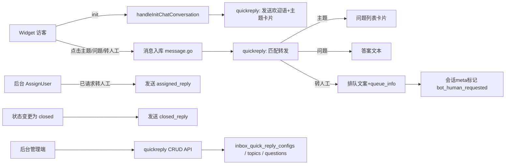

## 产品概述

在 libredesk 客服系统中新增"智能引导与转人工"自动化模块，覆盖会话创建引导、转人工排队、会话关闭三个环节的自动回复，配置按收件箱（Inbox）独立管理。

## 核心功能

1. **会话创建自动引导**

- 访客发起会话后，自动收到该收件箱配置的欢迎语，欢迎语末尾为"我要转人工"入口
- 欢迎语携带预设主题按钮；点击主题自动收到该主题下的问题列表（两级结构：主题→问题→答案）
- 点击具体问题自动回复对应答案

2. **"我要转人工"排队机制**

- 点击"我要转人工"后自动收到排队文案，并显示当前排队人数（未分配且状态为 open 的会话数）
- 会话被分配给客服时自动发送"已接入人工客服"文案，此后才进入真正人工对话

3. **会话关闭自动回复**

- 会话状态变更为 close 时自动发送关闭文案

4. **后台管理**

- 按收件箱配置欢迎语、转人工触发词、排队/接入人工/会话关闭三段文案
- 主题→问题→答案的增删改查与排序
- 模块启用/停用开关

## 技术栈选择

- 后端沿用现有 Go（fasthttp + fastglue + sqlx + PostgreSQL + Redis）技术栈，新增 `internal/quickreply/` 业务模块，完全复用 `internal/automation/` 的"Manager + queries.sql + models/"模块范式
- 后台管理前端沿用 `frontend/apps/main/`（Vue 3 + shared-ui + vue-i18n）
- Widget 访客端沿用 `frontend/apps/widget/`（Vue 3），复用消息 `meta` JSONB 机制（参考现有 `meta.is_csat` 特殊气泡模式）

## 实现方案

### 总体策略

新增独立模块 `quickreply`，在会话创建、消息进入、会话分配、状态变更四处既有事件点挂接自动回复逻辑，以 system user 身份发送消息并复用 `ShouldEvaluateAutomation` 防死循环；通过消息 `meta.type` 驱动 widget 端渲染可点击的快捷回复卡片与排队信息。

### 数据库设计（新增迁移，版本号取现有最大版本+1）

- `inbox_quick_reply_configs`：按 inbox_id 唯一存储 welcome_message、transfer_keyword（默认"我要转人工"）、queue_reply、assigned_reply、closed_reply、enabled 开关
- `quick_reply_topics`：inbox_id、name、sort_order
- `quick_reply_questions`：topic_id、question、answer、sort_order

### 自动回复触发链路

1. **会话创建**：`handleInitChatConversation` 初始化成功后，若该 inbox 配置启用，以 system user 发送欢迎语消息，`meta = {"type":"bot_quick_reply","items":[主题列表]}`
2. **访客消息匹配**（在 `internal/conversation/message.go` 用户消息入库后、自动化规则之前挂接）：

- 发送者为 system user 时直接跳过（防循环）
- 文本等于转人工触发词 → 发送排队文案消息（meta 携带 `queue_info` 排队数），并在会话 meta 中标记 `bot_human_requested=true`
- 文本精确匹配某主题名 → 发送该主题下问题列表（`bot_quick_reply` 卡片）
- 文本精确匹配某问题 → 发送对应答案（普通文本消息）
- 会话已分配客服或已请求转人工后，不再响应主题/问题匹配（进入等待或人工对话）

3. **排队人数**：`SELECT COUNT(*) FROM conversations WHERE assignee_id IS NULL AND status='open'`，回复时实时计算
4. **分配事件**：在 `AssignUser/AssignTeam` 成功且 `bot_human_requested=true`、且分配对象非 system user 时，发送 assigned_reply 并清除标记
5. **关闭事件**：在状态变更为 closed 的 Manager 层逻辑中发送 closed_reply（覆盖后台与 widget 两条关闭路径）

### 管理 API（cmd/quickreply.go，权限复用现有 inboxes:manage 模式）

- GET/PUT `/api/v1/inboxes/{id}/quick-reply-config`
- GET/POST `/api/v1/inboxes/{id}/quick-reply-topics`、PUT/DELETE `/api/v1/quick-reply-topics/{id}`
- POST `/api/v1/quick-reply-topics/{id}/questions`、PUT/DELETE `/api/v1/quick-reply-questions/{id}`

### 性能与可靠性

- 匹配查询按 inbox_id + 文本精确匹配建索引，单次匹配为 O(1) 索引查找，无 N+1；排队计数单条 COUNT 查询
- 所有机器人回复经统一 system-user 发送路径（QueueReply + broadcastMessageToWidgetClients），保证 widget 实时推送
- 自动回复逻辑整体用 defer/recover 兜底，任何配置缺失或匹配失败均静默降级为原有行为，不影响正常人工对话

## 实施要点

- 迁移注册方式、Manager 装配位置（cmd/main.go）、路由注册（cmd/handlers.go）严格参照现有 automation 模块
- 会话 meta 采用 `jsonb` 字段读写，参考现有 conversation meta 的存取模式，保持向后兼容
- 仅改动 `frontend/apps/widget`（正式 widget）；`widget-frontend/` 为独立简化版，本次不在范围内
- i18n 文案同步补充到 widget 与 main 的 locale 文件；不做无关重构

## 架构设计



## 目录结构

```
libredesk/
├── internal/
│   ├── quickreply/
│   │   ├── quickreply.go            # [NEW] Manager：配置/主题/问题 CRUD、匹配与回复发送（含防循环与排队计数）
│   │   ├── queries.sql              # [NEW] 全部 SQL 语句（go:embed），参照 automation/queries.sql 风格
│   │   └── models/
│   │       └── models.go            # [NEW] InboxQuickReplyConfig/QuickReplyTopic/QuickReplyQuestion 结构体
│   ├── migrations/
│   │   └── v2.7.0.go                # [NEW] 建表迁移（版本号按现有最大递增）
│   ├── conversation/
│   │   ├── message.go               # [MODIFY] 用户消息入库后挂接 quickreply 匹配（system user 直接跳过）
│   │   └── conversation.go          # [MODIFY] AssignUser/AssignTeam 发送接入文案；状态变 closed 发送关闭文案
│   └── inbox/                       # [MODIFY]（如需）暴露 inbox 读取给 quickreply
├── cmd/
│   ├── quickreply.go                # [NEW] 管理端 CRUD HTTP 处理器
│   ├── handlers.go                  # [MODIFY] 注册 quickreply 路由
│   ├── chat.go                      # [MODIFY] handleInitChatConversation 初始化后发送欢迎语
│   └── main.go                      # [MODIFY] 装配 quickreply Manager
├── frontend/apps/widget/src/
│   ├── components/
│   │   ├── QuickReplyCard.vue       # [NEW] 渲染 bot_quick_reply 卡片：按钮列表，点击发送后禁用
│   │   └── ChatMessages.vue         # [MODIFY] 按 meta.type 分发 QuickReplyCard 与 queue_info 排队信息气泡
│   ├── store/chat.js                # [MODIFY] 快捷回复点击→sendChatMessage 流程
│   └── locales/                     # [MODIFY] 新增/更新文案
└── frontend/apps/main/src/
    ├── api/quickreply.js            # [NEW] 管理端 API 客户端（axios 风格对齐现有 api 目录）
    ├── views/admin/quickreply/
    │   └── QuickReplyConfig.vue     # [NEW] 按收件箱配置欢迎语/三段文案/主题-问题-答案管理
    ├── router/index.js              # [MODIFY] 注册路由
    ├── layouts/admin/AdminLayout.vue# [MODIFY] 侧边栏菜单入口
    └── locales/                     # [MODIFY] 新增/更新文案
```

## 关键数据结构

```
// internal/quickreply/models/models.go
type InboxQuickReplyConfig struct {
    ID              int64     `db:"id"`
    InboxID         int64     `db:"inbox_id"`
    WelcomeMessage  string    `db:"welcome_message"`
    TransferKeyword string    `db:"transfer_keyword"` // 默认"我要转人工"
    QueueReply      string    `db:"queue_reply"`
    AssignedReply   string    `db:"assigned_reply"`
    ClosedReply     string    `db:"closed_reply"`
    Enabled         bool      `db:"enabled"`
    UpdatedAt       time.Time `db:"updated_at"`
}

type QuickReplyTopic struct {
    ID        int64  `db:"id"`
    InboxID   int64  `db:"inbox_id"`
    Name      string `db:"name"`
    SortOrder int    `db:"sort_order"`
}

type QuickReplyQuestion struct {
    ID        int64  `db:"id"`
    TopicID   int64  `db:"topic_id"`
    Question  string `db:"question"`
    Answer    string `db:"answer"`
    SortOrder int    `db:"sort_order"`
}
```

消息 meta 约定：`bot_quick_reply` = `{"type":"bot_quick_reply","items":[{"label":"...","value":"..."}]}`；排队信息 = `{"type":"queue_info","count":N}`；会话 meta 标记 `bot_human_requested`。

## 设计风格

- **后台管理端（main）**：延续现有 shared-ui 企业级后台风格，采用卡片式分栏布局。页面顶部为收件箱选择器与启用开关；主体分两个区域——"自动回复文案"区（欢迎语、转人工、接入人工、会话关闭四个可折叠配置卡，textarea 编辑+字数提示）与"主题与问题"区（左侧主题列表，右侧问题-答案可编辑表格，支持拖拽排序、行内新增/删除）。整体白底浅灰背景、圆角卡片、hover 高亮、轻量过渡动画，保持与现有自动化页面一致的视觉语言。
- **Widget 访客端**：快捷回复卡片采用气泡内圆角按钮组设计，按钮浅色底、品牌色文字，点击后按钮灰化禁用并立即发送对应文本，保证操作反馈即时；排队信息以独立高亮条（浅琥珀色背景+图标）展示"当前排队人数为 N"，与普通消息明确区分。消息气泡、头像、时间样式与现有聊天 UI 完全一致，不引入新的视觉体系。

## Agent 扩展

### Skill

- **lsp-code-analysis**
- 用途：在实现后端挂接点（message.go/conversation.go 的事件调用处）与前端组件引用时，用语义导航确认函数定义、调用链与影响面，避免文本搜索遗漏
- 预期结果：精确锁定 Automation 规则调用点与 widget 消息渲染分发点，确保新逻辑插入位置正确

### SubAgent

- **code-explorer**
- 用途：在联调阶段批量核对迁移注册、路由注册、Manager 装配与 i18n 文案是否全部落地
- 预期结果：输出完整变更清单核对结果，防止遗漏文件或调用点