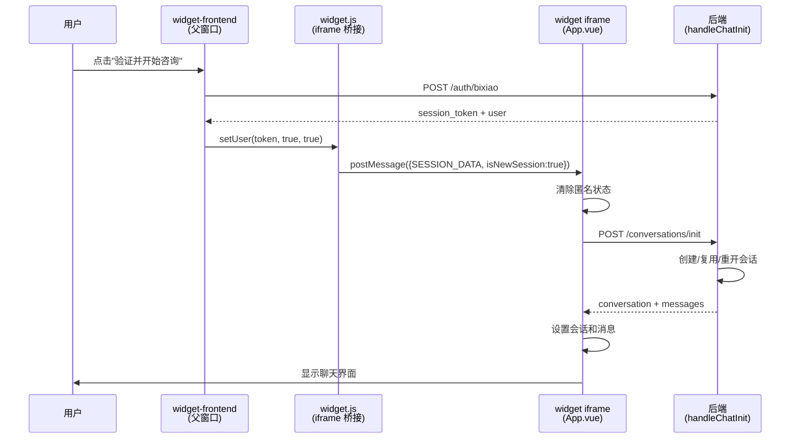

## 产品概述

修复 widget 端用户通过 Bixiao 认证后，会话初始化流程不正确的问题。确保用户点击"验证并开始咨询"后，后端能正确执行会话的创建/复用/重开逻辑。

## 核心功能

- 用户首次认证时创建新会话
- 用户已有 open 状态会话时直接进入
- 用户已有 close 状态会话时重新打开（设为 open + 未分配），重发欢迎消息和预设问题，显示历史聊天记录
- 每个用户始终复用同一条会话

## 问题分析

### 当前流程（有 Bug）

1. Widget 加载 → iframe 内 `ChatView.vue` 以匿名身份自动创建会话 A
2. 用户点击"验证并开始咨询" → Bixiao 认证成功 → 获得 session token
3. `useWidget.js` 调用 `api.setUser(sessionToken, true)` → `widget.js` 发送 `SESSION_DATA` postMessage 到 iframe
4. iframe 内 `App.vue` 收到 `SESSION_DATA` → 设置 token → 调用 `fetchInitialConversations()`
5. `fetchInitialConversations` 通过 `GET /conversations` 加载**旧的匿名会话 A**（属于匿名 contact），而非 Bixiao 认证用户的会话
6. 如果会话 A 已关闭 → 用户看到关闭提示，无法正常使用

### 根本原因

`SESSION_DATA` handler 使用 `fetchInitialConversations`（调用 `GET /conversations`）加载会话列表，不会触发后端 `handleChatInit`（`POST /conversations/init`）的会话创建/复用/重开逻辑。后端 `handleChatInit`（`cmd/chat.go` L178-348）已正确处理所有三种情况：

- 无会话 → 创建新会话 + `ProcessIncomingMessageHooks` 发送欢迎消息
- 有 open 会话 → 直接复用，返回历史消息
- 有 closed 会话 → `ReopenAndUnassignConversation` + `SendWelcomeReply` 发送欢迎消息和主题卡片

## 技术方案

### 核心思路

在 `SESSION_DATA` postMessage 中增加 `isNewSession` 标志，区分"首次 Bixiao 认证"和"回访用户 cookie 恢复"两种场景：

- **首次认证**（`isNewSession: true`）：清除匿名状态 → 调用 `initChatConversation` 触发后端 `handleChatInit`
- **回访用户**（无 `isNewSession`）：保持原有 `fetchInitialConversations` 逻辑不变

### 数据流



## 实现细节

### 目录结构

```
widget-frontend/src/composables/
└── useWidget.js          # [MODIFY] setUser 调用增加第三个参数 isNewSession=true

static/
└── widget.js             # [MODIFY] setUser 方法接收并透传 isNewSession 标志

frontend/apps/widget/src/
└── App.vue               # [MODIFY] SESSION_DATA handler 中根据 isNewSession 走不同初始化流程
```

### 关键实现

**文件 1: `widget-frontend/src/composables/useWidget.js`**

- 位置: L126-128，`verifyBixiaoAuth` 函数
- 将 `api.setUser(sessionToken, true)` 改为 `api.setUser(sessionToken, true, true)`
- 第三个参数 `true` 表示这是新认证会话

**文件 2: `static/widget.js`**

- 位置: L583-589，`setUser` 方法
- 方法签名增加 `isNewSession` 参数
- 在 `SESSION_DATA` postMessage 中增加 `isNewSession: !!isNewSession`
- 回访用户的 `SESSION_DATA` 由 L454-459 的 cookie 恢复逻辑发送，不经过 `setUser`，不受影响

**文件 3: `frontend/apps/widget/src/App.vue`**

- 位置: L84-109，`SESSION_DATA` handler
- 读取 `event.data.isNewSession`
- 当 `isNewSession === true` 时：

1. 清除 chatStore 中的匿名会话状态（`setCurrentConversation(null)`, `conversations = null`）
2. 调用 `api.initChatConversation({})` 触发后端 `handleChatInit`
3. 解析响应，设置 conversation、messages、business_hours 到 chatStore
4. 调用 `widgetStore.navigateToChat()` 导航到聊天视图

- 当 `isNewSession` 不为 true 时（回访用户）：保持原有 `fetchInitialConversations()` 逻辑

### 竞态条件分析

- `ChatView.vue` 的 `onMounted` 也会调用 `initConversationForWelcome` → `initChatConversation`
- 但已有守卫 `if (!chatStore.currentConversation?.uuid && !isInitializing.value)`
- SESSION_DATA handler 先执行，已设置 `currentConversation`，ChatView 的守卫会跳过重复初始化
- `show()` 在 `setTimeout 400ms` 后调用，此时 SESSION_DATA handler 已完成

### 注意事项

- `static/widget.js` 是运行时直接加载的文件，修改后需要重新构建/部署
- `initChatConversation` 已通过 `api` 默认导出，无需额外导入
- 后端 `handleChatInit` 已处理所有三种情况，前端只需正确调用即可